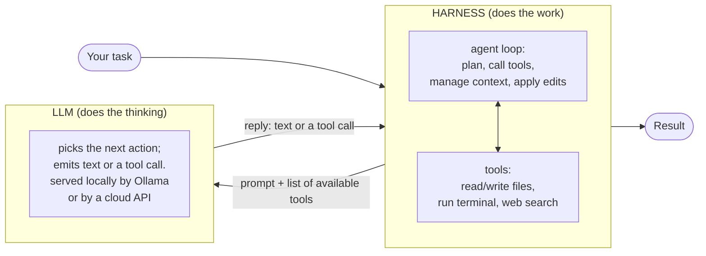

# local-llm-lab

Field notes from running AI LLM harnesses and local models on a deliberately limited desktop
(RTX 5070 12 GB / 32 GB RAM). What actually fits, what runs fast, which harness to use, and how we
tested it. Updated 2026-09-09.

This is a working lab notebook, not a product. Numbers are from one machine ("DARKTEXAS"); treat them
as directional. Everything here was measured, not guessed.

## LLM vs harness (how they relate)

*The LLM is the brain; the harness is the body. The model only predicts text, it cannot touch your files
or run commands. The harness wraps it in a loop: it sends the model a prompt plus the list of tools it may
use, the model replies with either an answer or a tool call, and the harness executes that call (read a
file, run a command), feeds the result back, and repeats until the task is done. The model is swappable,
served locally by Ollama or by a cloud API, without changing the harness around it.*

## TL;DR for a 12 GB / 32 GB box

- **Inference harness: Ollama.** Easiest, GPU-accelerated on Blackwell, OpenAI-compatible API, every agent
  tool plugs into it. LM Studio is a fine GUI alternative; llama.cpp for max control; vLLM only if you are
  serving many concurrent users (needs Docker + more VRAM).
- **What runs well locally:**
  - 7-14B dense at Q4/Q8 -> fully on GPU, fast (60-120 tok/s). The daily-driver class.
  - 30B **MoE with ~3B active** -> runs with CPU offload at a usable ~34-37 tok/s. Punches above its class.
  - 30B **dense** -> technically loads via offload but ~4-5 tok/s. Not practical here.
  - 100B+ / 1T models (Kimi, DeepSeek V4-Pro) -> do NOT run on this box. Cloud/API only.
- **The one rule that matters at 12 GB:** for anything above ~14B, only low-active-param MoE is usable.
  Active parameters, not total size, decide whether CPU offload wrecks your speed.
- **Agent harness:** Claude Code (cloud) for the hard work; **Aider** + **Open Interpreter** drive local
  models well; **DeepSeek Harness (dsh)** is promising but early; **opencode** works on local Ollama once
  you fix the config (127.0.0.1 + apiKey) and use a native-tool-calling model - see
  [OPENCODE-OLLAMA.md](OPENCODE-OLLAMA.md).

## Docs in this repo
- [HARDWARE.md](HARDWARE.md) - the exact box and its ceilings.
- [HARNESSES.md](HARNESSES.md) - inference harnesses and agent harnesses, with our findings.
- [OPENCODE-OLLAMA.md](OPENCODE-OLLAMA.md) - deep dive: why opencode "hangs" on local Ollama and the fix.
- [MODELS.md](MODELS.md) - local models tried, what fits, the MoE-vs-dense lesson.
- [METHODOLOGY.md](METHODOLOGY.md) - how we benchmark (probes, tok/s, placement).
- [RESULTS.md](RESULTS.md) - the measured numbers.
- [benchmarks/](benchmarks/) - the benchmark scripts.

## How to reproduce quickly
1. Install Ollama. `ollama pull qwen3:14b` (or any model in MODELS.md).
2. `ollama ps` shows GPU/CPU split; the API is at `http://127.0.0.1:11434`.
3. Run a probe with the script in `benchmarks/`.
